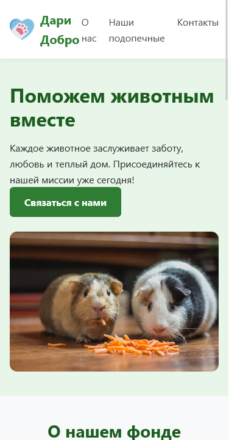
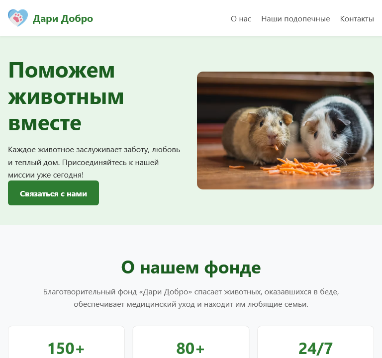
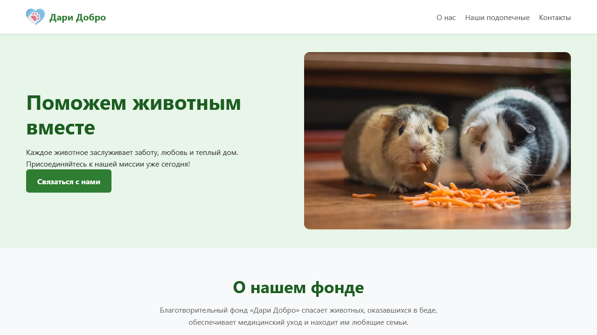

Лендинг для Фонда помощи животным «Дари Добро»

Тема: Фонд помощи животным
Ссылка на GitHub Pages: https://dylndylndyln.github.io/landing-timuruly/

Что сделано:
1. Использована семантическая верстка HTML5 (`<header>`, `<nav>`, `<main>`, `<section>`, `<article>`, `<footer>`).
2. Размещены заголовки всех уровней (`<h1>`, `<h2>`, `<h3>`).
3. Для всех изображений заданы описательные атрибуты `alt`.
4. В теге `<head>` настроены `title`, `meta description`, `viewport`, а также подключен `favicon`.
5. Реализована валидная форма обратной связи с полями (Имя, Email, Сообщение), использованы атрибуты `label` и `required`.
6. Сверстано 5 полноценных информационных блоков.
7. Реализована адаптивная верстка с помощью Media Queries (корректно отображается на экранах от 375px до 1280px и выше).
8. Код написан вручную на чистом HTML5 и CSS3 без использования фреймворков и конструкторов (с помощью Gemini)

Responsive (Скриншоты)
Ниже представлены скриншоты отображения сайта на трех контрольных ширинах экрана:

Мобильная версия (375px)
Меню располагается вертикально, карточки выстраиваются в 1 колонку.

Планшетная версия (768px)
Меню переходит в горизонтальную строку, карточки отображаются по 2 в ряд.

Десктопная версия (1280px)
Полноразмерная сетка, элементы Hero расположен в 2 колонки, карточки по 3 в ряд.

Почему были использованы Sass + BEM
Использование препроцессора Sass вместе с методологией БЭМ существенно повышает структурированность и масштабируемость CSS-кода. Sass экономит время благодаря переменным, избавляя от ручного изменения одинаковых цветов или шрифтов по всему файлу. Кастомные миксины для медиа-запросов позволяют управлять адаптивностью (телефон, планшет, десктоп) в одном месте и сокращают дублирование кода. Вложенность selectors (Nesting) идеально сочетается со структурой БЭМ, позволяя наглядно видеть границы блоков, элементов (`__`) и модификаторов (`--`). По сравнению с методологией Bootstrap или Tailwind, Sass даёт полный контроль над объемом финального кода без подгрузки сторонних библиотек, хотя и требует предварительной компиляции SCSS в чистый CSS для работы на продакшене (GitHub Page).

